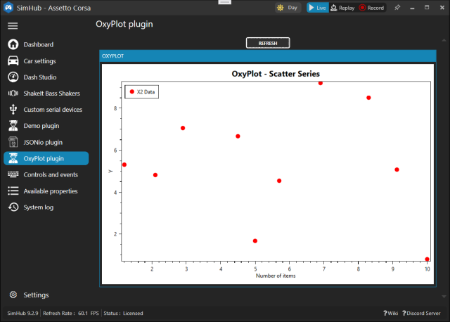
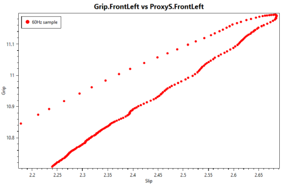

# OxyScope from SimHubPluginSdk
XY plot of *positive* property values  
[UI control explanations](https://blekenbleu.github.io/SimHub/oxyhelp.htm)  
- Create a new WPF project named `OxyPlotPlugin` in Visual Studio, then quit.  
- delete (or move away) all but `OxyPlotPlugin.sln` and `OxyPlotPlugin.csproj`  
- copy all but .sln and .csproj from SimHubPluginSdk
- split diff edit OxyPlotPlugin.sln and SimHubPluginSdk.sln
	- delete `GlobalSection(ExtensibilityGlobals) = postSolution` from OxyPlotPlugin.sln
- split diff edit OxyPlotPlugin.csproj and SimHubPluginSdk.csproj; changes in OxyPlotPlugin.csproj:
	- change `OutputType` to `Library`; add `<AppDesignerFolder>Properties</AppDesignerFolder>`
	- delete last 4 lines in that PropertyGroup
	- delete `PlatformTarget`s; change OutputPath to $(SIMHUB_INSTALL_PATH)
	- insert unique SimHubPluginSdk PropertyGroups for Release and Debug
	- insert unique SimHubPluginSdk References
	- delete unique OxyScope References
	- insert unique SimHubPluginSdk Compile ItemGroups
	- delete unique OxyScope lines  

### Done
- convert content from SimHubPluginSdk namespace `Sdk.Plugin` to `blekenbleu.OxyScope`
	Control.xaml (2x), Control.xaml.cs, Plugin.cs, Settings.cs
- in Plugin.cs, changed:  
```
    [PluginDescription("XY OxyPlot of paired SimHub properties")]
    [PluginAuthor("blekenbleu")]
    [PluginName("OxyScope")]
	...
	...
	public string LeftMenuTitle => "OxyScope " + PluginVersion;
```
- added OxyPlot stuff for scatter plot  
	  
- break out scatterplot method from keypress event
- update plot data from Plugin.cs  
	  
- ping pong buffers for capturing high dynamic range sample sets  
- "autoexposure" `Refresh` button visible only for value captures
- capture property names and validate values of selected properties  

### Many plot properties can change between plots
- `new ScatterSeries` each time...

#### 10 Nov:&nbsp; better prompts and feedback
- better icon, simpler xaml, version number
- both X and Y autorange based on max property sample values
- **Replot** when min sample values < `X Below`, `Y Below` % of corresponding max values
#### 21 Nov:
- `View.Dispatcher.Invoke()` to auto `View.Replot()` *from* `DataUpdate()` *thread*
- least squares linear estimators
- added X, Y property IIR filter sliders
#### 23 Nov:&nbsp; revise UI options
- separately report current *sample* X, Y min, max  
- also always show current *plot* statistics
- eliminate Threshold, Below sliders
- Replot button: **Auto** vs **Manual**
- update button: **3 second refresh** vs **Hold max X range**
- cubic fit added
#### 26 Nov:&nbsp; force monotonic cubic slope at Xmin or Xmax
- forcing endpoint slopes sometimes results in very poor fit
- update button: **3 second refresh** vs **Hold max X range** vs **Hold max R-squared**
#### 28 Nov:&nbsp; Fit.Curve() to iteratively match [constrained cubic function](https://blekenbleu.github.io/static/ImageProcessing/MonotoneCubic.htm)
- debug using simple cubic function
- *30 Nov*:&nbsp;  Montonic() debugged

<hr>
<b><i>Property folder changes from default WPF project for SimHub plugins</i></b>
<details><summary>click for differences</summary>
<ul>
<li>delete <code>Settings.Designer.cs<code> and <code>Settings.settings</code>
<li>copy <code>DesignTimeResources.xaml</code>
<li>in AssemblyInfo.cs, replace NeutralResourcesLanguage assembly lines with SimHubPluginSdk's one-liner
<li>in Resources.Designer.cs, add 10 lines for sdkmenuicon
<li>in Resources.resx, add 4 lines for sdkmenuicon; force othe lines to match
</ul>
</details>
