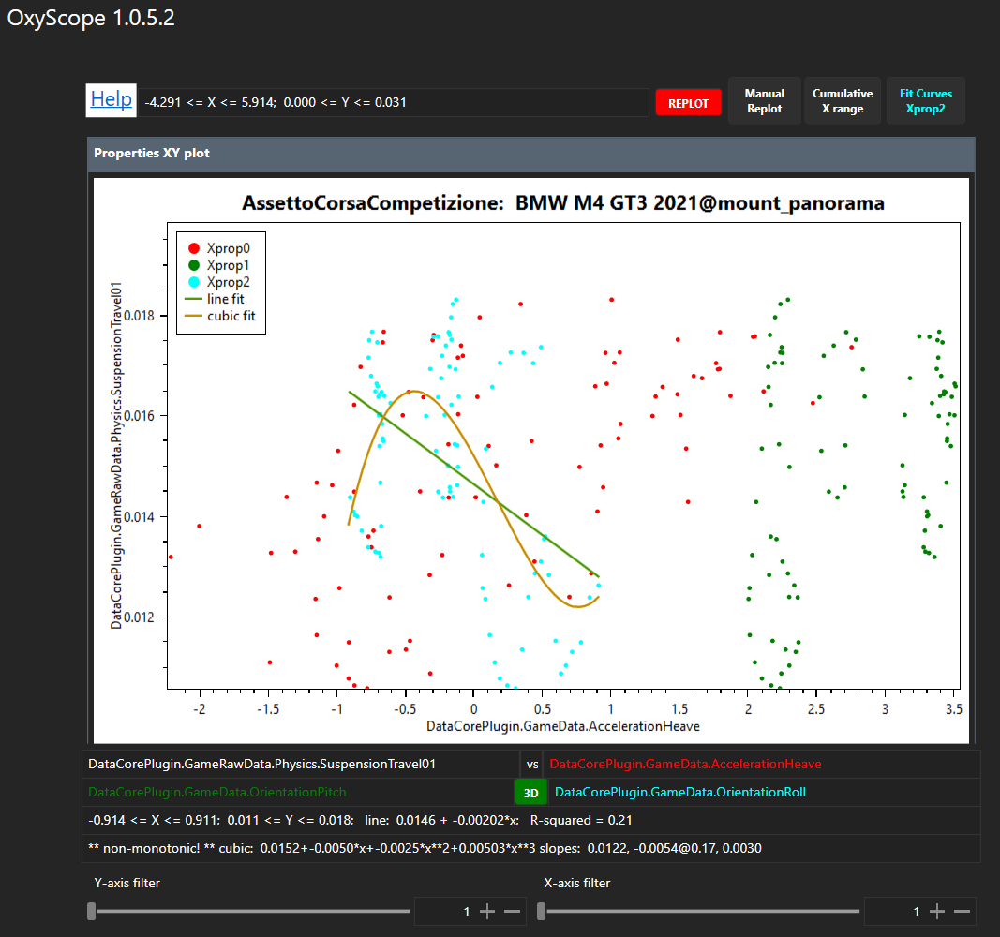

# OxyPlotPlugin from SimHubPluginSdk
- Create a new WPF project named `OxyPlotPlugin` in Visual Studio, then quit.  
- delete (or move away) all but `OxyPlotPlugin.sln` and `OxyPlotPlugin.csproj`  
- copy all but .sln and .csproj from SimHubPluginSdk
- split diff edit OxyPlotPlugin.sln and SimHubPluginSdk.sln
	- delete `GlobalSection(ExtensibilityGlobals) = postSolution` from OxyPlotPlugin.sln
- split diff edit OxyPlotPlugin.csproj and SimHubPluginSdk.csproj; changes in OxyPlotPlugin.csproj:
	- change `OutputType` to `Library`; add `<AppDesignerFolder>Properties</AppDesignerFolder>`
	- delete last 4 lines in that PropertyGroup
	- delete `PlatformTarget`s; change OutputPath to $(SIMHUB_INSTALL_PATH)
	- insert unique SimHubPluginSdk PropertyGroups for Release and Debug
	- insert unique SimHubPluginSdk References
	- delete unique OxyPlotPlugin References
	- insert unique SimHubPluginSdk Compile ItemGroups
	- delete unique OxyPlotPlugin lines  

### Done
- convert content from SimHubPluginSdk namespace `Sdk.Plugin` to `OxyPlotPlugin`
	Control.xaml (2x), Control.xaml.cs, Plugin.cs, Settings.cs
- in Plugin.cs, changed:  
```
    [PluginDescription("An XY OxyPlot of 2 SimHub properties")]
    [PluginAuthor("blekenbleu")]
    [PluginName("OxyPlot plugin")]
	...
	...
	public string LeftMenuTitle => "OxyPlot plugin";
```
- added OxyPlot stuff for scatter plot
	  
- break out scatterplot method from keypress event
- update plot data from Plugin.cs  
	
### To Do
#### refresh plot without `new`
	[`PlotModel.InvalidatePlot(true)`](https://oxyplot.readthedocs.io/en/master/common-tasks/refresh-plot.html);&nbsp;
	[example](https://github.com/oxyplot/oxyplot/blob/develop/Source/Examples/WPF/WpfExamples/Examples/RealtimeDemo/MainViewModel.cs#L91C18-L91C49)
	- [C#Corner live demo](https://www.c-sharpcorner.com/article/live-chart-streamed-data-update-using-oxyplot/),
	[performance discussion](https://github.com/oxyplot/oxyplot/issues/1801),
	[RealTimeDemo](https://github.com/oxyplot/oxyplot/tree/develop/Source/Examples/WPF/WpfExamples/Examples/RealtimeDemo),  
	[PerformanceTest](https://github.com/alxkalinin/oxyplot/tree/develop/Source/Examples/PerformanceTest) example using `RenderingExtensions.DrawReducedLine` method,  
	[RenderingExtensions.DrawReducedLine](https://svitla.com/blog/wpf-application-with-real-time-data-in-oxyplot-charts) tutorial discussion
- ping pong buffers for capturing high dynamic range sample sets
- interactively capture names and validate values of selected properties
- update plotted property value array at run time


<details><summary>click for Properties folder differences</summary>
<ul>
<li>delete <code>Settings.Designer.cs<code> and <code>Settings.settings</code>
<li>copy <code>DesignTimeResources.xaml</code>
<li>in AssemblyInfo.cs, replace NeutralResourcesLanguage assembly lines with SimHubPluginSdk's one-liner
<li>in Resources.Designer.cs, add 10 lines for sdkmenuicon
<li>in Resources.resx, add 4 lines for sdkmenuicon; force othe lines to match
</ul>
</details>

